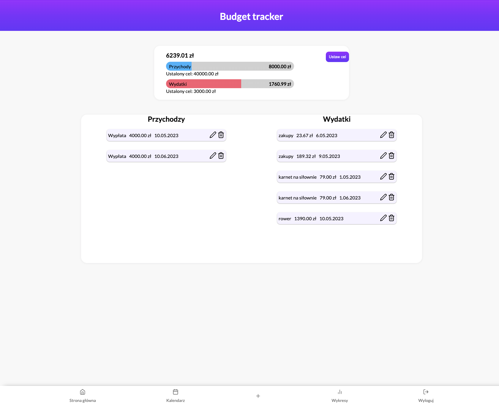
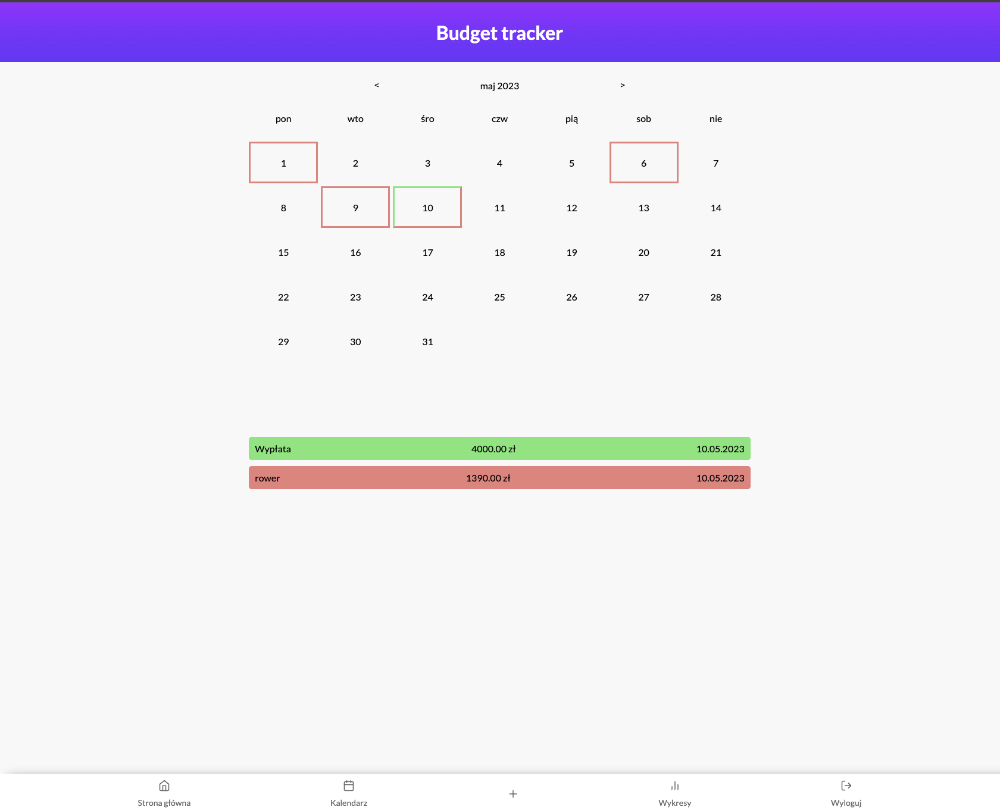
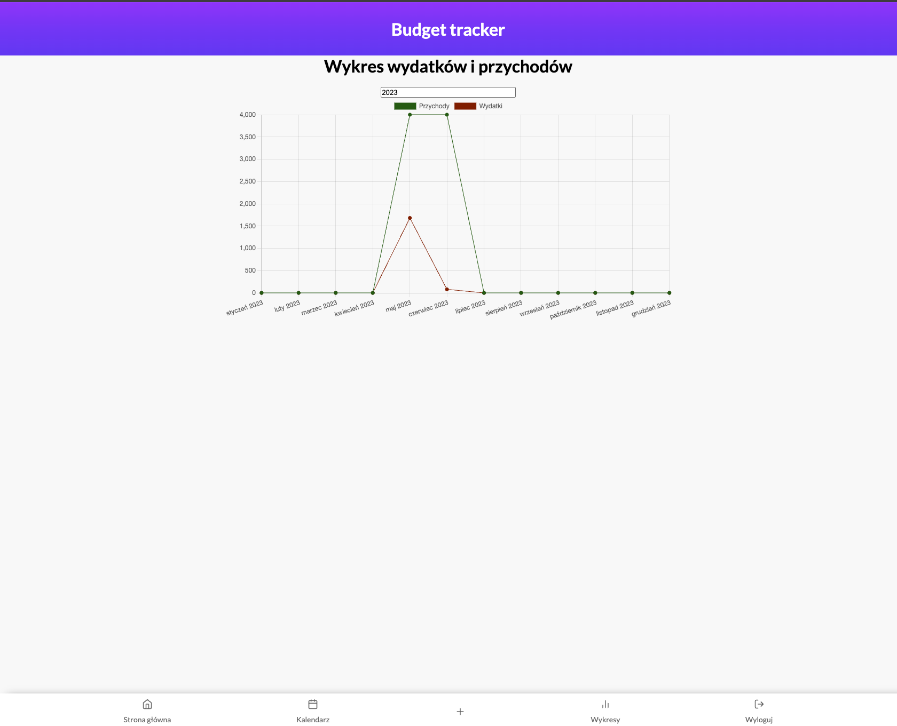

# Budget App

A comprehensive web application to help you track and manage your personal finances. Budget App allows you to record your income and expenses, visualize your spending patterns through charts, and view your financial activities in a calendar format.

## Table of Contents

- [Budget App](#budget-app)
  - [Table of Contents](#table-of-contents)
  - [Overview](#overview)
  - [Key Features](#key-features)
  - [Technologies Used](#technologies-used)
    - [Frontend Technologies](#frontend-technologies)
  - [Getting Started](#getting-started)
    - [Prerequisites](#prerequisites)
    - [Installation and Setup](#installation-and-setup)
  - [Testing Credentials](#testing-credentials)
    - [Demo Account](#demo-account)

## Overview

Budget App is a personal finance management tool that helps you keep track of your earnings and expenses. It provides a user-friendly interface to record financial transactions, visualize spending patterns, and monitor your budget goals.

The application solves the common problem of tracking where your money goes and helps you make informed financial decisions by providing clear visualizations of your spending habits.

[Live Demo](https://budget-app-502e6.web.app/)





## Key Features

- **User Authentication**: Create and manage your personal account to keep your financial data secure
- **Transaction Recording**: Easily add income and expense records with descriptions and dates
- **Financial Dashboard**: View a summary of your current financial status on the home page
- **Interactive Charts**: Visualize your spending patterns and income sources through intuitive charts
- **Calendar View**: Track your financial activities by date in a calendar format
- **Budget Goals**: Set and monitor income and expense goals to help manage your finances

## Technologies Used

### Frontend Technologies

- **HTML5**: Structure and content of the application
- **Sass/SCSS**: Advanced styling with variables and nested rules
- **JavaScript (ES6+)**: Core application logic and interactivity
- **Firebase**:
  - Authentication for user management
  - Realtime Database for storing and retrieving financial data
  - Hosting for application deployment
- **Chart.js**: Interactive and responsive charts for financial data visualization

## Getting Started

### Prerequisites

- A modern web browser (Chrome, Firefox, Safari, Edge)
- Node.js and npm (if you want to run the project locally)
- Git (for cloning the repository)

### Installation and Setup

1. Clone the repository:

   ```bash
   git clone https://github.com/radekrzepka/budget-app.git
   ```

2. Navigate to the project directory:

   ```bash
   cd budget-app
   ```

3. If you want to run the project locally with Firebase, you'll need to:

   - Create a Firebase project at [Firebase Console](https://console.firebase.google.com/)
   - Set up Authentication and Realtime Database
   - Update the Firebase configuration in `public/js/firebaseService.js`

## Testing Credentials

### Demo Account

You can use the following credentials to test the application:

| Role          | Email          | Password |
| ------------- | -------------- | -------- |
| Standard User | test@gmail.com | qwerty   |

The demo account is pre-populated with sample transactions to help you explore all features of the Budget App.
